## Overview
This project could be separated to three parts.  
1. The first part is microcontroller Renesas RX62T;  
2. The second part is the robot be controlled by 10 motors;  
3. The last part is computing engine (laptop) connected to Kinect;  

All motors is be controlled by microcontroller through PWM.  
The microcontroller communicates to PC via RS232.  

Please refer following overview picture:  
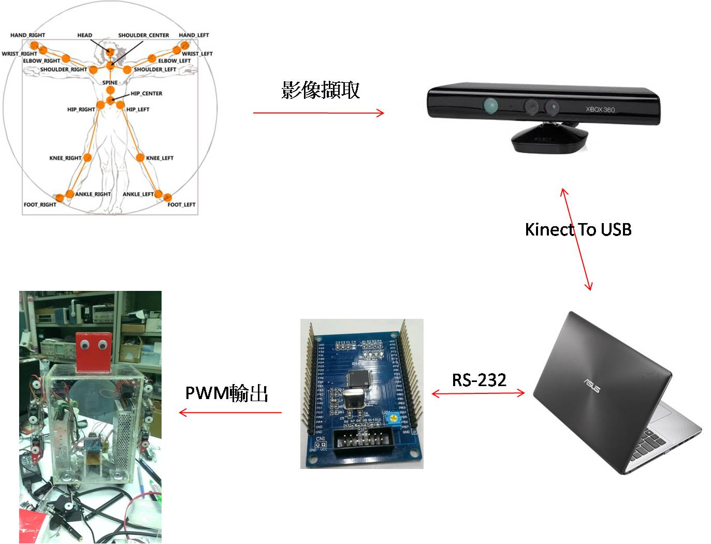  

## Microcontroller
The microcontroller of this project is using Renesas RX62T and related  
 specifications or sample code could be found on Renesas website.  

The following diagram is what this project using:  
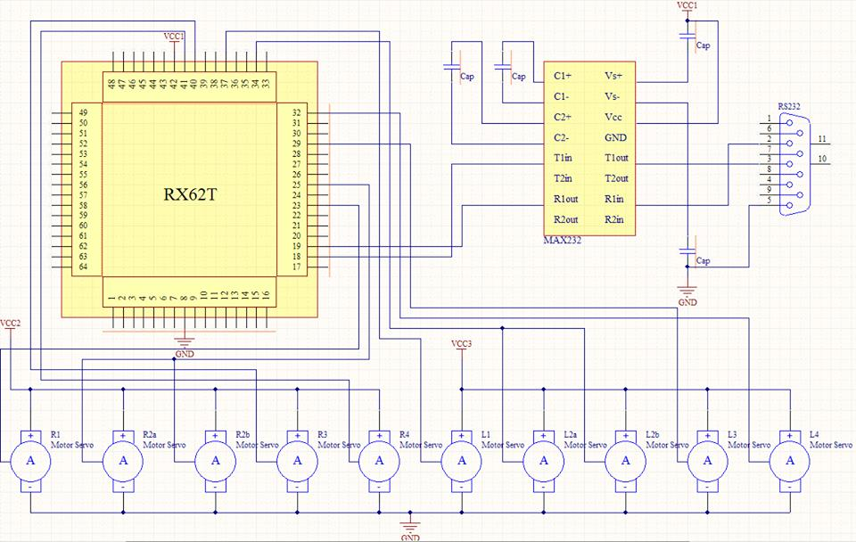  

## Algorithm
The computing engine will gather user's motion through Kinect using Kinect's SDK.  

Refer following pictures to know how it works:  
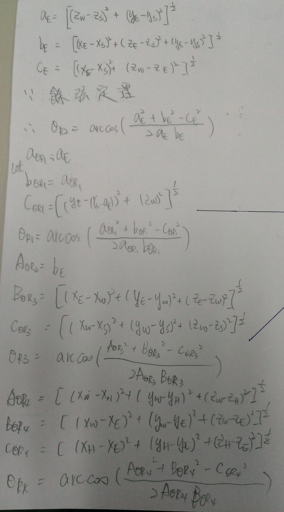  
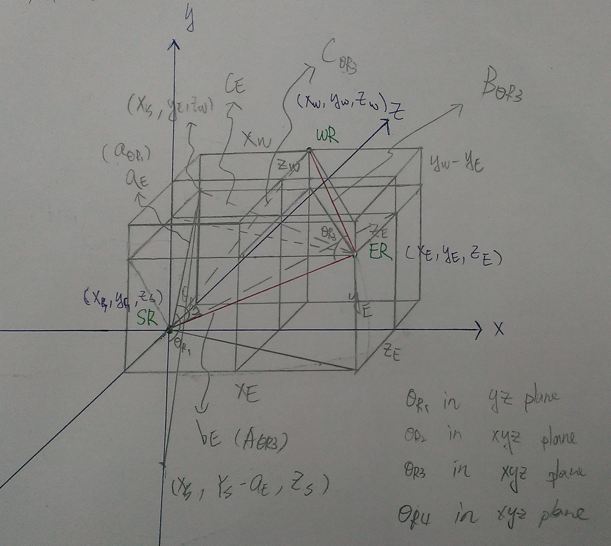  

## Construct Robot
The important part of robot is its arms.  
Thus, feel free to customize robot's body.  
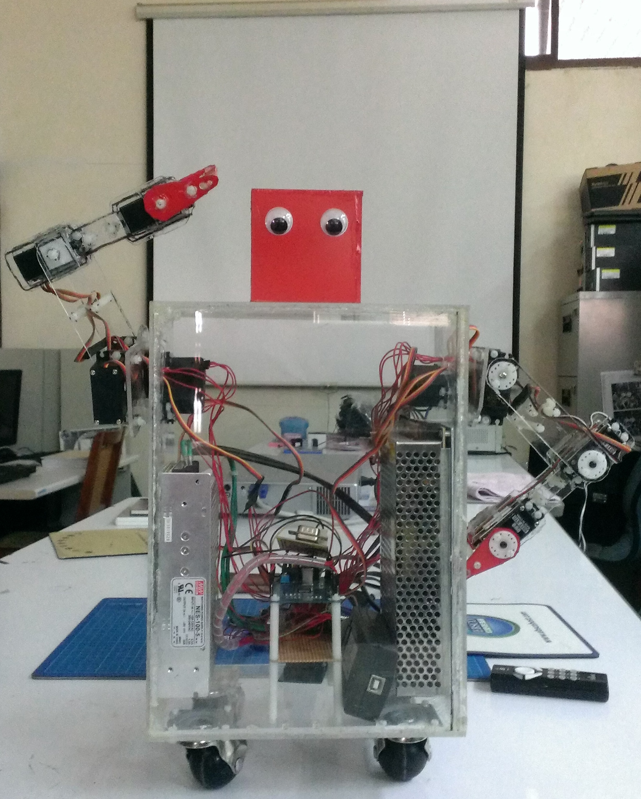  
  

Refer following pictures to cutting acrylic sheets:  
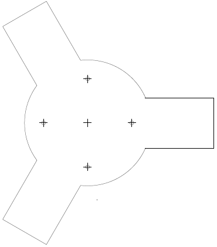  
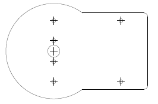  
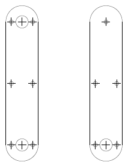  
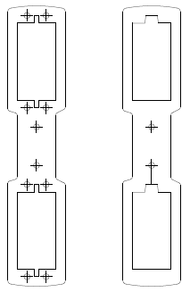  
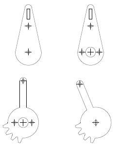  
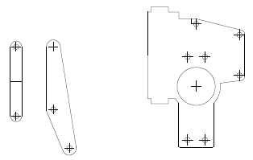  
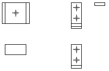  

## Instance

